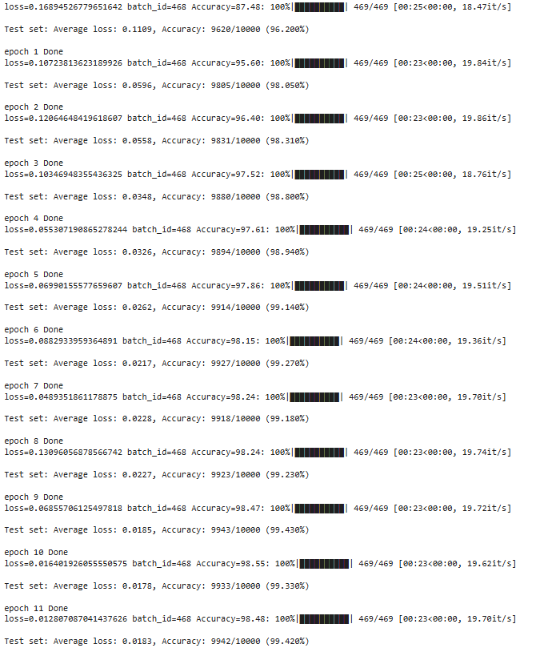

# MNIST Classification with PyTorch

[](https://github.com/anudeep-j98/cnn_training_learinig/actions/workflows/ci-cd.yml)

This project implements a convolutional neural network (CNN) for classifying handwritten digits from the MNIST dataset using PyTorch. The model is designed to achieve high accuracy while maintaining a low number of parameters.

## Project Structure

cnn_accuracy_imnprove│

├── .github/

│   └── workflows/

│       └── ci-cd.yml

│

├── model/

|   |── deploy.py       # To deploy model (Not Tested)

│   ├── eval.py         # contains evaluation metric calculations

│   ├── net.py          # Model architecture

│   └── train.py        # Training script

├── tests/

│   └── test_model.py   # Testing script

│

└── README.md            # Project documentation


## Model Architecture

The model is defined in `model/net.py` and consists of the following layers:

- **Convolutional Layers**: Four convolutional layers with ReLU activation.
- **Fully Connected Layers**: Two fully connected layers leading to the output layer.
- **Batch Normalization Layers**: Two BN layers
- **GAP and Fully Connected Layers**: GAP and Two fully connected layers leading to the output layer.

### Model Characteristics

- **Parameters**: Less than 20,000 parameters.
- **Accuracy**: Achieves over 99% accuracy on the MNIST test set after 20 epoch. Attachingm train logs SS below for reference



## Setup Instructions

1. **Clone the repository**:
   ```bash
   git clone <repository-url>
   ```

2. **Install the required packages**:
   ```bash
   pip install torch torchvision
   ```

3. **Run the training script**:
   ```bash
   python model/train.py
   ```

4. **Run the tests**:
   ```bash
   python -m unittest discover tests/
   ```

## Testing

The testing script (`tests/test_model.py`) includes the following tests:

1. **Parameter Count**: Checks that the model has less than 20,000 parameters.
2. **Accuracy**: Validates that the model achieves over 99.4% accuracy on the MNIST test set.
3. **Batch Normalization check**: Ensures the model architecture contains Batch normalization layer.
4. **Dropout check**: Ensures the model architecture contains Dropout layer.
5. **GAP and Full connected layer check**: Ensures the model architecture contains GAP and Fully connected layer.

## CI/CD Pipeline

The project includes a GitHub Actions workflow defined in `.github/workflows/ci-cd.yml`. This workflow will:

- Install dependencies.
- Train the model.
- Run the tests.

The CI/CD pipeline is triggered on every push to the `main` branch.
